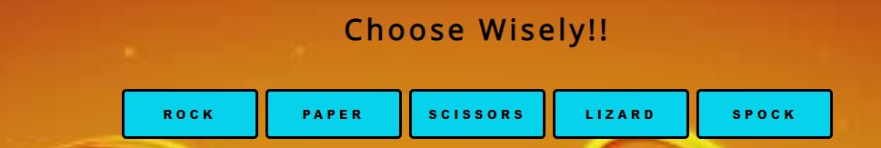
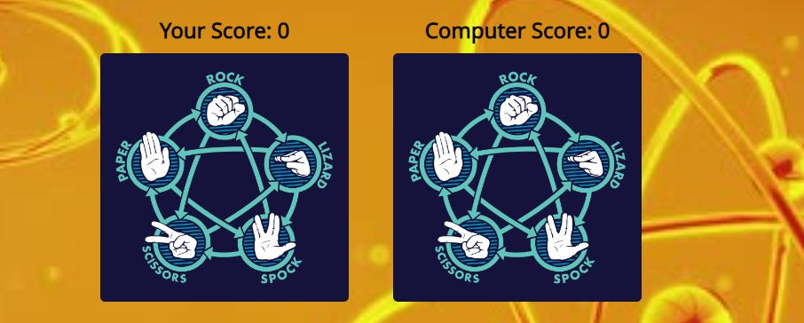
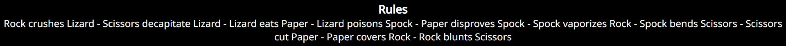
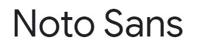
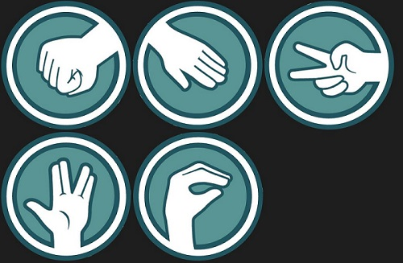
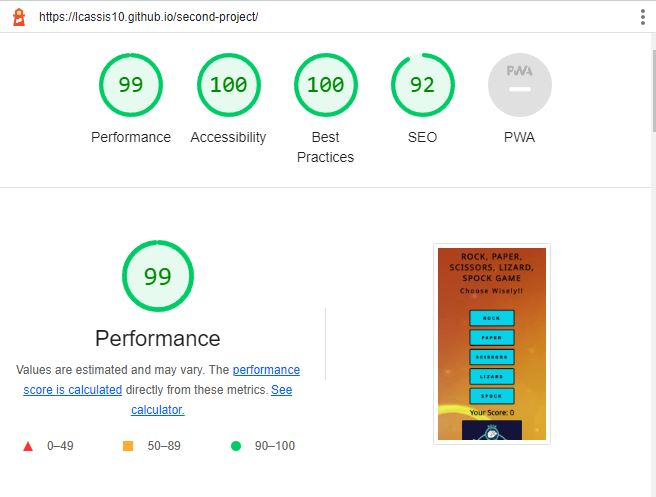
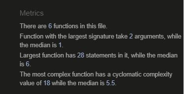
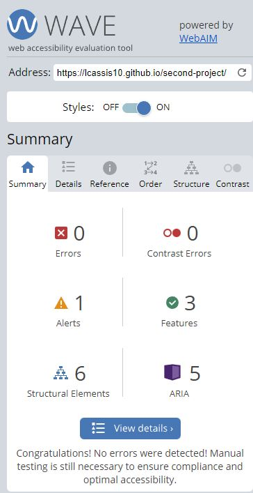
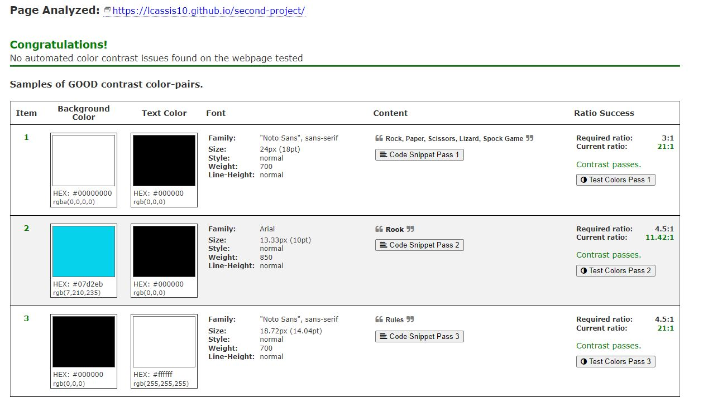
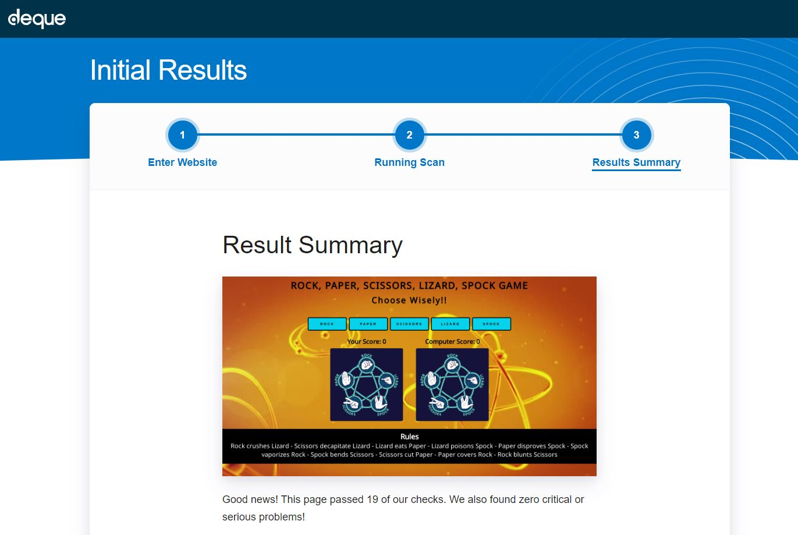

# Rock, Paper, Scissors, Lizard, Spock Game

Rock, Paper, Scissors, Lizard and Spock Game is a simple and easy to understand game, it is a derivation of the rock, paper, scissors game.

It was created based on the television series "The Big Bang Theory".

The game can be played by both adults and children. To start it is very simple, the user selects one of the options and the computer randomly chooses an option. Once both players have chosen their options, the game will show who won and which option was chosen by each. Depending on who wins, your score will be updated and the game will continue as long as the user is interested.

The game is compatible with any screen size, from cell phones to computer screens.

# Features

### Existing Features

- Featured at the top of the page the header shows the game name and has a clearly contrast with the background.

- The header tells the user what game they are playing.

- __The Game Options__

    - The games options include clear instruction in the section rules and the choice of buttons: Rock, Paper, Scissors, Lizard and Spock. 

    - These options are interactive, and the user can click to make their choice.

- __Game area__

    - If the user chooses an option, the image will change to the one he chooses and randomly, the computer image will also change.

    - After the computer randomly chooses one, it will be determined the victory of one of the two.

    - The winner is announced to the user above the options button, and the score is updated for either the user or the computer, depending on who on.

    - The results ans score are clear to the user, making the game easy to play, understand who won and waht the score is.

- __Rules area__

     - The section rules show the rules of the game to the user.

# Design

- Color Scheme:

   - I trialled many different color palettes whilst building the game and settled on lighter colors which makes a good contrast with the orange of the background image
 that show the idea of ​​a game. The choice of colors was to provide the maximum possible contrast and make it easy for the user to see. The rules section has been placed in black color and large letters so the user can easily understand why he/she or the computer won that match.

### #0000

 

### #07D2EB

 

### #00008B

 

### #ADFF2F

 

### #DF9729

 

### #FFFFF

 

- Background

  - The chosen background is an image that constantly appears in the television series "The Big Bang Theory", which created the game and inspired the project.

- Typography

  - I choose 'Noto Sans' as the font for the site. It is a big bold type that stands out from the background well and is easy to read.

- The images of each game option were chosen according to the initial image of each player, thus being easy to understand.

# Testing

### Lighthouse

- The web page was tested using the Lighthouse feature on the chrome browser giving the following result.

### Validator testing

- HTML
    - No errors were returned when passing through the official W3C validator.

- CSS
    - No errors were returned when passing through the official (Jigsaw) validator.

- JavaScript
    - No errors were found when passing through the official Jshint validator.

- WAVE Web Accessibility Evaluation Tool

    - The WAVE tool was used to test the page for accessibility.

- I decided to check the webpage in two other accessibility checkers namely color.a11y.com and audit.deque.com. Both of these sites reported no errors.

### Responsiveness

 - Media queries based on screen width were used to ensure the page displayed correctly across a range of screen sizes. the Chrome and Edge browsers were used to test responsiveness. I also used the device specific tool within these browsers to test a number of devices representng a wide range of device types.
The results are given below.

  |Device               |Result                       |
  |---------------------|-----------------------------|
  | Iphone SE           | Displays ok                 |
  | Iphone XR           | Displays ok                 | 
  | Iphone 12 pro       | Displays ok                 | 
  | iPhone 6/7/8        | Displays ok                 | 
  | Ipad Mini           | Displays ok                 |
  | Ipad Air            | Displays ok                 | 
  | Galaxy Fold         | Displays ok                 |
  | Surface Pro 7       | Displays ok                 |
  | Surface Duo         | Displays ok                 | 
  | Samsumg Galaxy A51  | Displays ok                 | 
  | Nest Hub            | Displays ok                 | 
  | Nest Hub Max        | Displays ok                 |

### Game results

 - I tested the game results and are always correct.

# Unfixed Bugs

- No unfixed bugs.

# Deployment

- The site was deployed to GitHub pages. The steps to deploy are as follows:

- In the GitHub repository, navigate to the Settings tab In the pages section, go to select branch drop-down menu, select Main Once the Main branch has been selected, a link to the site is provided.

- The live link can be found here - https://lcassis10.github.io/second-project/

# Credits

 ### Content

  - When making my project, I was inspired by the Code Institute Rock, Paper, Scissors, Lizard, Spock idea.

  - Font was sourced from Google Fonts https://fonts.google.com/

 ### Media

  - Pictures were taken from the Google Images.

